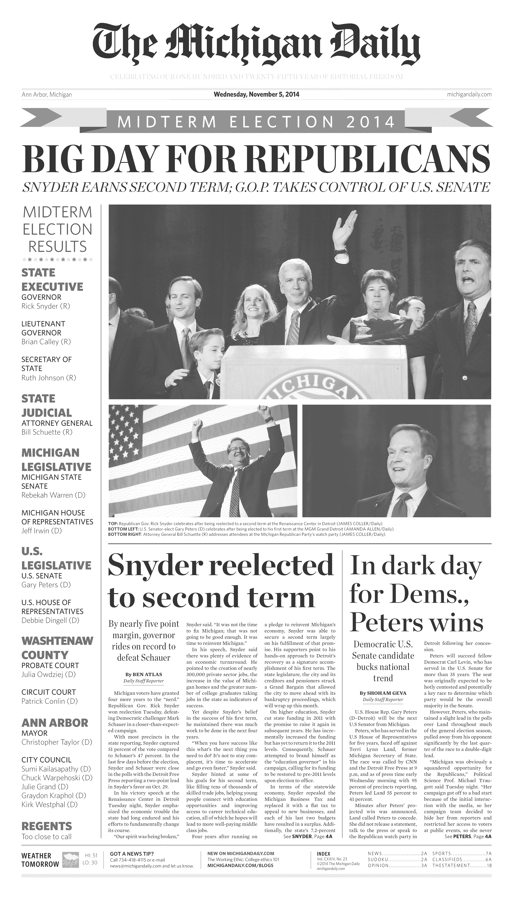

# OCR
## Description:
This repo contains an OCR (Optical Character Recognition) based Text Recognition using PILLOW, Pytesseract and OpenCV.
The main goal is to read a newspaper and recognize faces and texts from each pages and display appropriate results when user searches for any keyword in the paper.

## Tools/Modules Involved:
<ul>
  <li>  PILLOW for Image Processing </li>
  <li>  OpenCV for Image Processing </li>
  <li> Pytesseract for OCR (Optical Character Recognition) </li>
</ul> 

## Steps for execution:
<li> An examplar view of the Newspaper's first page in binarized form is provided below: </li>

<li> Faces in the newspaper is recognized via haarcascade_frontalface_default.xml file whose github link is: https://github.com/opencv/opencv/blob/master/data/haarcascades/haarcascade_frontalface_default.xml <li>

<li> The faces are recognized as shown in the image: </li>

<li> Sample result when an user searches for "Christopher" </li>

You can see that it renders all the detected faces from first page of the paper, since it successfully finds the keyword in the newspaper text.
